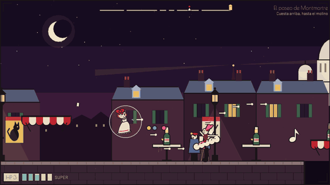
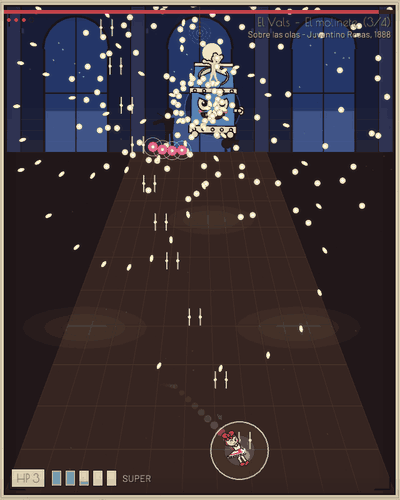
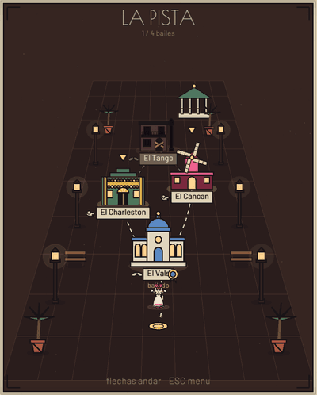
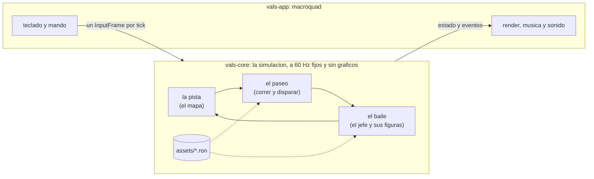

# VALS

**Un boss-rush danmaku con niveles de correr y disparar, escrito en Rust. Cada
jefe es un baile, y sus balas son la coreografia.**

**[Jugar en el navegador](https://diegocj30.github.io/vals/)** — teclado o mando,
sin instalar nada.



| El Vals, tercera figura | La pista, el mapa entre bailes |
|---|---|
|  |  |

## Cada jefe es un baile

Y no de nombre: cada uno tiene **un verbo del motor que es solo suyo**, cada fase
es **una figura real** de ese baile y las balas caen **en el compas de su
musica**. Un test impide que un baile use el verbo de otro.

| Baile | Su verbo | Sus figuras |
|---|---|---|
| **El Vals** | `Turn`: la mira gira y sale la espiral | el paso de cambio, el giro natural, el giro inverso, el fleckerl |
| **El Tango** | `accel` negativa: la bala frena en seco y vuelve, como el corte | la caminata, los ochos, el molinete |
| **El Charleston** | `spin`: la bala curva, como el pie sobre la planta, en la clave 3-3-2 | el basico, bee's knees, el cambio de lado |
| **El Cancan** | `ttl` corto: la patada sale y se desvanece | el battement, el port d'armes, la rueda y el grand ecart |

| Los ochos: los anillos frenan y vuelven sobre el 8 que dibuja el jefe | El basico: cada patada es un arco |
|---|---|
|  |  |

**[Los cuatro bailes, figura a figura](docs/BAILES.md)**: el paso de verdad, como
lo dibujan las balas y su foto de larga exposicion.

## Que hay dentro

- **Cuatro jefes que son objetos vivos**: El Vals es una caja de musica, El
  Tango un bandoneon, El Charleston un gramofono y El Cancan una fila de
  coristas. Cada uno tiene sus figuras (fases), su musica y una gramatica de
  balas propia: el vals gira, el tango frena en seco, el charleston curva.
- **Cuatro paseos**, niveles de correr y disparar de lado antes de cada jefe:
  Viena, un arrabal de Buenos Aires, las azoteas de Chicago y la cuesta de
  Montmartre hasta el Moulin Rouge.
- **Fichas y la modista**: cada paseo esconde fichas de baile, unas en el camino
  y otras donde cuesta llegar, que en la tienda del mapa se cambian por otro
  tiro (abanico, castanuela, serpentina) o un amuleto. Un paseo ya andado se
  repite desde el mapa con `X` (cuadrado) a por las que falten.
- **Un mapa** con un monumento por baile, que se abre segun avanzas, y el
  progreso guardado entre partidas.
- **Parry y super**: parriar las balas rosas llena el medidor y el super limpia
  la pantalla. El juego premia meterse entre las balas en vez de huir de todas.
- **Dos formas de moverse**: los jefes se esquivan **volando**, como un danmaku
  clasico, y los paseos se corren **en el suelo**, con gravedad y salto.
- Estetica de **cartel de la Belle Epoque**, con grano de pelicula, y musica de
  piezas de dominio publico (Strauss, Juventino Rosas, Joplin, Offenbach)
  transcritas a tablas de notas.

## Controles

| | Teclado | Mando |
|---|---|---|
| Mover | Flechas / WASD | Stick o cruceta |
| Disparar | `Z` | R1 / R2 |
| Saltar (en los paseos) | Arriba / `W` / `K` | Boton de abajo (X en PlayStation, A en Xbox) |
| Dash, con invulnerabilidad | `X` | Cuadrado / X |
| Parry | `C` | Circulo / B |
| Super | `Espacio` | Triangulo / Y |
| Focus (lento; en los paseos, plantarse y apuntar) | `Shift` | L1 / L2 |
| Volver al mapa o al menu | `Esc` | Triangulo / Y, fuera del combate |
| Quitar el temblor de la tinta | `T` | |

## Como esta hecho



- **Simulacion determinista en un crate puro.** `vals-core` es todo el juego
  —balas, jefes, jugadora, paseos, mapa— y no depende de macroquad ni de
  ninguna libreria grafica. Avanza a paso fijo de 60 Hz con su propio generador
  aleatorio, y `vals-app` solo pone ventana, render, input y audio encima,
  interpolando entre ticks.
- **Replays y un test de regresion dorado.** Como la simulacion es
  determinista, una partida es una semilla mas la lista de inputs: 30 segundos
  ocupan 4 KB. Hay un replay versionado que se reproduce en cada push
  comparando huellas del estado; si cambia la jugabilidad sin querer, falla.
  Eso es lo que permite optimizar el bucle caliente sin miedo.
- **Jefes y niveles son datos.** Cada jefe es un fichero RON con un pequeno
  lenguaje de patrones (`Fire`, `Turn`, `Repeat`, `Parallel`, `MoveTo`...) y
  cada paseo otro RON con su suelo, plataformas y enemigos. En nativo hay
  **hot-reload**: se guarda el fichero y el cambio entra sin recompilar.
- **Cero imagenes.** Todo lo que se ve se dibuja con codigo: personajes como
  esqueletos animados con miembros en curva Bezier, balas desde un shader con
  render instanciado (a 32.000 balas, 144 fps frente a 30 con las primitivas de
  macroquad) y decorados procedurales. La musica y los efectos se sintetizan al
  arrancar. Los unicos ficheros de arte son dos tipografias con licencia OFL.
- **El mismo codigo en nativo y en web.** Compila a `wasm32` sin
  `wasm-bindgen`; el mando (gilrs en nativo, Gamepad API en web) y el guardado
  (`localStorage`) se conectan con plugins de miniquad de unas pocas lineas.
- **377 tests**, entre ellos bots que recorren cada paseo de punta a punta,
  tests que exigen que cada baile use su verbo del motor y no el de otro, y uno
  que planta a una jugadora quieta en cada punto de la pantalla para que ninguna
  figura deje un sitio donde quedarse sin esquivar. El CI
  pasa `cargo fmt`, `clippy -D warnings`, los tests, el replay dorado y el
  build web en cada push.
- **Las mediciones estan escritas.** [`docs/PERF.md`](docs/PERF.md) es el
  historico de rendimiento, con cada optimizacion medida antes y despues.

## Compilar

Hace falta Rust estable.

```bash
cargo run -p vals-app --release   # jugar en nativo
cargo test                        # tests, incluido el replay dorado
```

Build web (Windows; en otro sistema son los mismos dos pasos del script):

```powershell
powershell -File scripts/build-web.ps1
python -m http.server 8080 --directory web
```

Replays, mediciones y las imagenes de los bailes:

```bash
cargo run -p vals-core --example replay_tool -- verify assets/replays/golden.valsrpl
cargo run -p vals-app -- --replay replays/<fichero>.valsrpl   # F2 guarda la partida en curso
cargo run -p vals-core --example partituras   # regenera docs/media/partituras
cargo bench -p vals-core --bench sim
cargo run -p vals-app --release -- --bench-scene 20000 --frames 400
```

| Crate | Que hace |
|---|---|
| `crates/vals-core` | La simulacion: determinista, sin dependencias graficas. |
| `crates/vals-app` | Ventana, render, input y audio con macroquad. |
