# Los cuatro bailes

En VALS cada jefe es un baile de verdad, y sus balas siguen las reglas de ese
baile. No es decoracion: cada uno tiene **un verbo del motor que es solo suyo**,
cada fase es **una figura real** de ese baile, en el orden en que se aprende, y
las esperas del patron caen **en el compas de su musica**.

| Baile | Su verbo | Lo que hacen las balas | Compas |
|---|---|---|---|
| **El Vals** | `Turn` | la mira gira, y las balas salen en espiral | 3/4 |
| **El Tango** | `accel` negativa | salen, frenan en seco y vuelven por donde vinieron | 4/4 marcado |
| **El Charleston** | `spin` | vuelan en arco | clave 3-3-2 |
| **El Cancan** | `ttl` corto | cortan un trozo de sala y se desvanecen | 2/4, el galop |

Que ningun baile use el verbo del vecino no es una intencion: lo vigila un test,
`cada_baile_tiene_su_verbo_y_no_el_del_vecino` en
[`crates/vals-core/src/boss.rs`](../crates/vals-core/src/boss.rs). Si el tango
empieza a girar o el vals a curvar, el CI falla.

## Como leer las partituras

Cada imagen es una **foto de larga exposicion** de una figura, sacada de la
simulacion real: una jugadora quieta e invulnerable abajo en el centro (el
rombo blanco), sin disparar, y el obturador abierto un par de segundos.

- Cada bala que sale en ese rato deja su **trayectoria** con un punto cada 4
  ticks. Donde los puntos se apelotonan, la bala iba despacio.
- Las trazas mas vivas son las de las balas mas nuevas.
- La linea discontinua de color es el **camino del jefe**: el dibujo que hace en
  la pista.
- Encima, la foto fija del ultimo instante. Los colores son los del juego:
  hueso las pequenas, amarillo las agujas, naranja las medianas, verdigris las
  grandes y **rosa las que se pueden parrear**.

Las genera `cargo run -p vals-core --example partituras`
([`examples/partituras.rs`](../crates/vals-core/examples/partituras.rs)) a
partir de los mismos RON que juega el juego, asi que no pueden mentir: si se
reafina un baile, se relanza y las imagenes cambian con el.

---

## El Vals

**Viena, siglo XIX.** El vals vienes es el vals rapido de los Strauss, y es
casi todo girar: a derechas (el giro **natural**) o a izquierdas (el
**inverso**), con pasos de cambio, que no giran, para pasar de un sentido al
otro.

**El verbo: `Turn`.** Cada `Turn` tuerce la mira del hilo que dispara, y una
tanda tras otra con la mira torcida es una espiral. Es el unico baile que gira
asi, y el signo es el sentido del baile: positivo a derechas, negativo a
izquierdas.

```ron
Turn(0.31),   // el giro natural: a derechas, tanda tras tanda
```

**El objeto: una caja de musica**, con la tapa abierta y su bailarina girando
encima. Da vueltas porque le han dado cuerda y baila en tres tiempos porque es
lo unico que sabe tocar. En el fleckerl se rompe: grietas y muelles saltando.

**La musica:** *El Danubio azul* (Johann Strauss II, 1866), el mismo Danubio
reflejado en menor, *Sobre las olas* (Juventino Rosas, 1888) y la coda del
Danubio, un tono mas arriba y a toda velocidad.

| | |
|---|---|
| 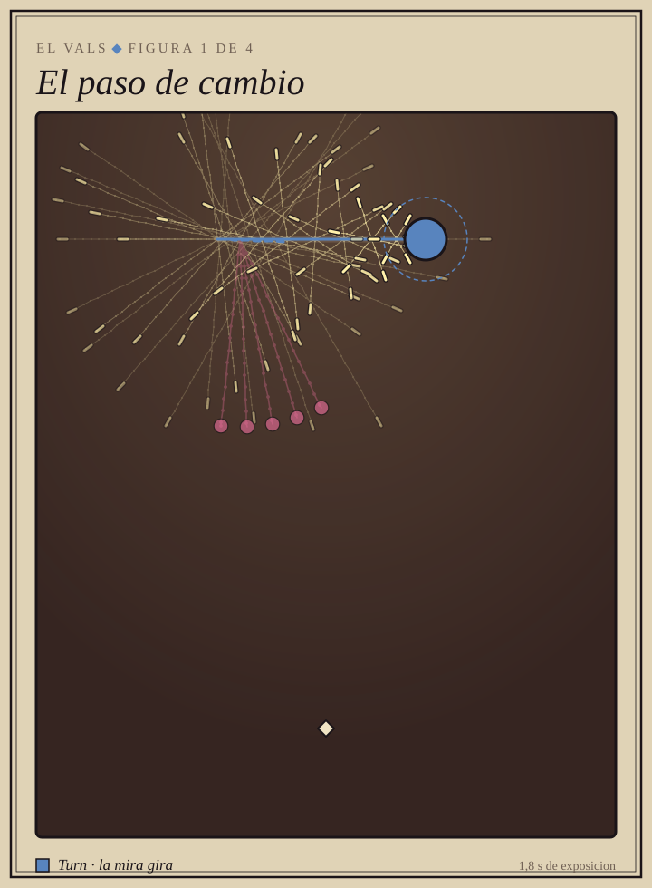 | **1. El paso de cambio.** En la pista: tres pasos sin girar que cambian el sentido del giro. Es lo primero que se ensena.<br><br>En el juego: tres `Turn(0.2)` y tres `Turn(-0.2)`. La espiral avanza un compas hacia un lado, vuelve, y nunca llega a dar la vuelta: los huecos se quedan casi quietos. |
| 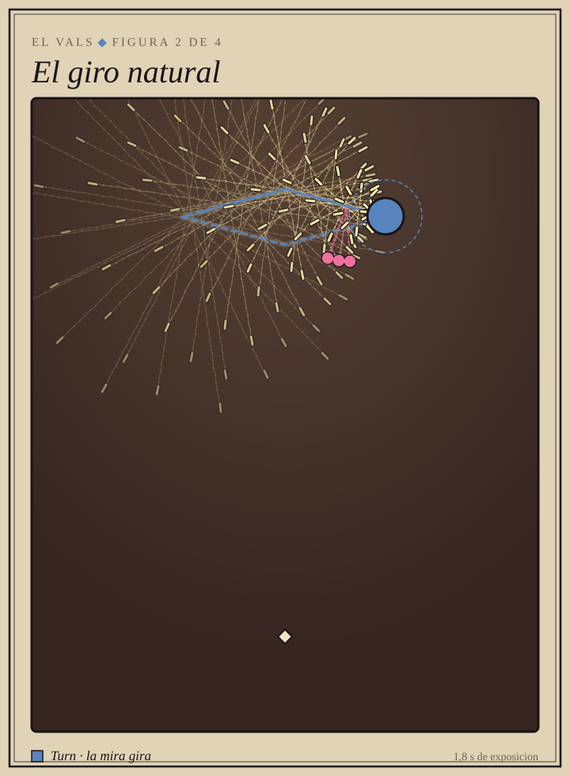 | **2. El giro natural.** En la pista: la vuelta a derechas.<br><br>En el juego: dos brazos con `Turn` positivo, a favor de las agujas del reloj, y el jefe recorriendo su rombo tambien a derechas. |
| 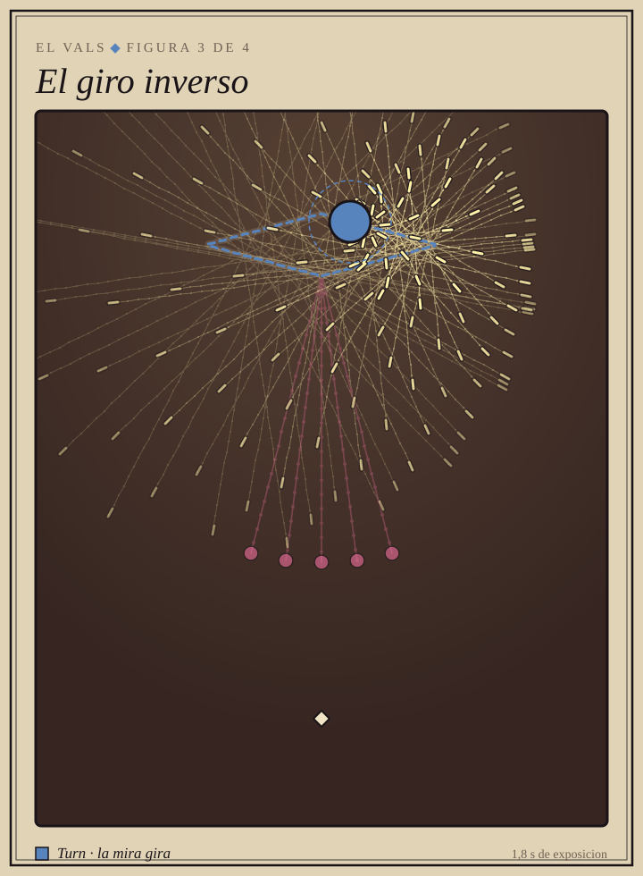 | **3. El giro inverso.** En la pista: la vuelta a izquierdas, la que mas gira de todas.<br><br>En el juego: el natural en un espejo. `Turn` negativo, el rombo recorrido al reves, y un poco mas rapido y denso, porque se aprende despues. |
| 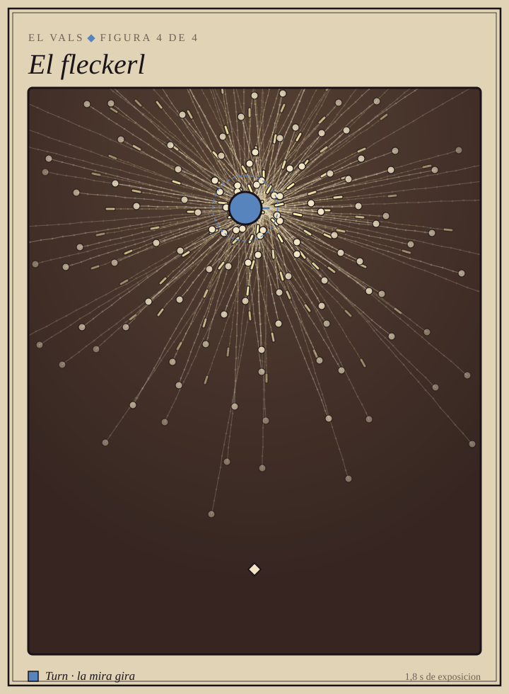 | **4. El fleckerl.** En la pista: girar muy rapido **en el sitio**, en el centro de la sala, primero inverso y luego natural, con un *contra check* entre medias. La figura de lucimiento.<br><br>En el juego: el jefe se planta en el centro y los dos brazos giran juntos a izquierdas y luego a derechas. Justo cuando el giro se para y se da la vuelta, el check: un anillo gordo rosa y una rafaga a por ti. |

> Una espiral se enrosca tan cerrada que en una foto fija parece una explosion:
> el giro se ve en movimiento. Es el gif de la tercera figura del
> [README](../README.md).

---

## El Tango

**El Rio de la Plata, hacia 1880**, en los arrabales de Buenos Aires y
Montevideo. Los manuales de principios del siglo XX ya hablan de bailar *con
corte*: el corte es la parada en seco, el freno en mitad del paso.

**El verbo: `accel` negativa.** La bala sale, se queda sin velocidad y vuelve
por donde vino, justo al punto donde nacio. Es el corte hecho bala. Y **no hay
un solo `Turn`** en todo el fichero: el tango va en linea recta y cambia de
golpe. Hasta el molinete gira a saltos de angulo fijo.

```ron
accel: -190.0,   // los ochos: sale, frena en seco y vuelve
```

**El objeto: un bandoneon** con brazos y cara. Su baile es el fuelle: abre y
cierra de golpe, se pasa un pelo y se clava hasta el tiempo siguiente. Un fuelle
que respirase suave seria un vals. Empieza de galan, con la rosa entre los
dientes, y en el molinete se le raja el fuelle.

**La musica:** *La Cumparsita* (Matos Rodriguez, 1916), primera parte, segunda
parte y vuelta a la primera, disparada. A 120 negras por minuto un tiempo son
30 ticks, y todas las esperas del patron son multiplos de 30: **las balas caen
con la musica**.

| | |
|---|---|
| 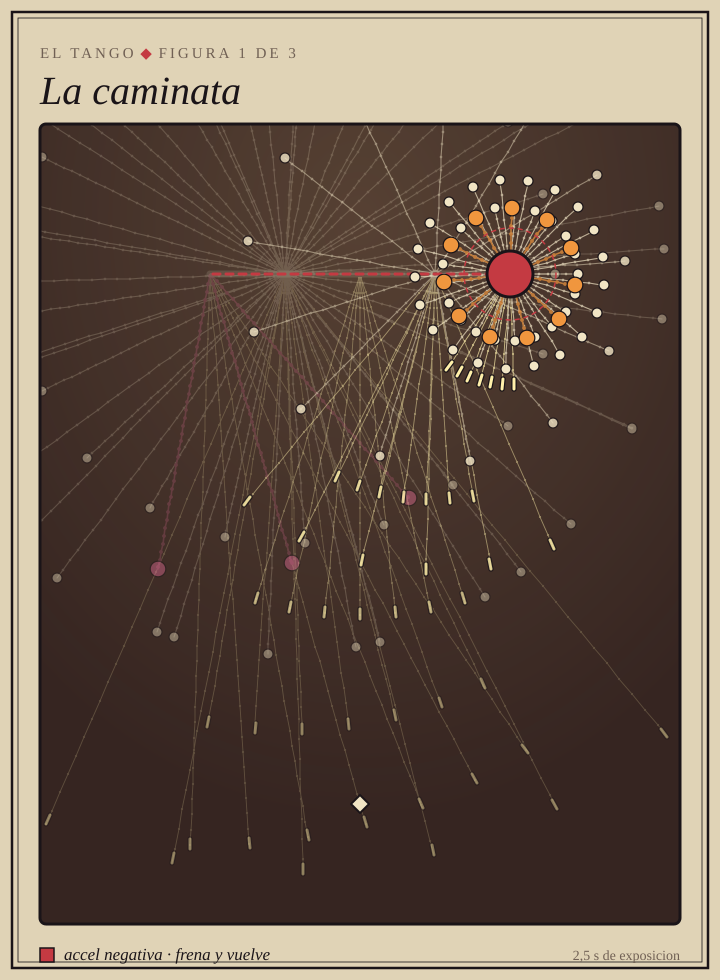 | **1. La caminata.** En la pista: el paso del tango, recto, marcado y con pausa.<br><br>En el juego: el jefe anda un compas y se clava otro. Al clavarse suelta un anillo que frena flojo y vuelve, la frenada en pequeno para aprenderla. Mientras anda, un golpe recto a ti en cada tiempo: las tandas quedan escalonadas por la linea, como pisadas. |
| 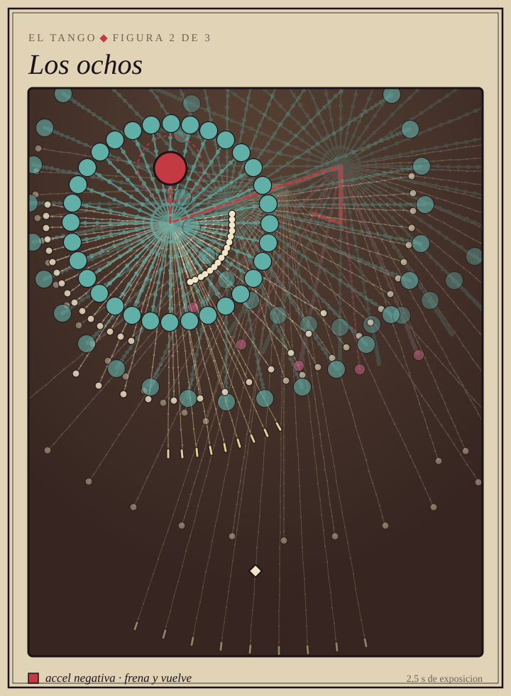 | **2. Los ochos.** En la pista: ella cruza por delante, pivota y cruza al otro lado, y sus pies dibujan un 8 en el suelo.<br><br>En el juego: el jefe dibuja el 8 con rectas, y en cada pivote suelta un anillo de balas grandes que frena y vuelve a su sitio: los anillos se cierran uno tras otro **sobre el dibujo**. Los abanicos alternan de un lado a otro, como la cadera. |
| 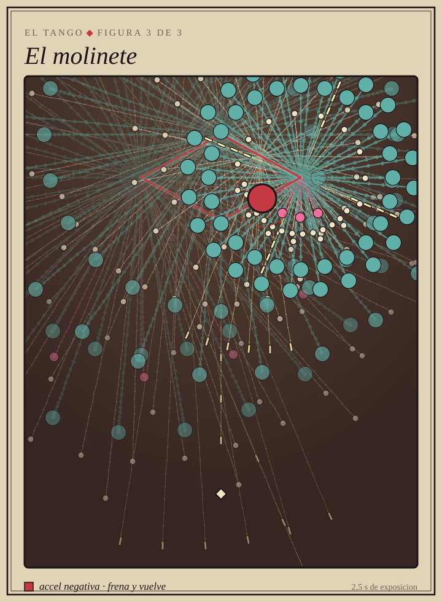 | **3. El molinete.** En la pista: ella da la vuelta al hombre en cuatro pasos, adelante, al lado, atras, al lado, y el hace de eje.<br><br>En el juego: el jefe recorre un rombo, un paso cada dos tiempos. En cada esquina, la frenada a dos capas y las aspas del molino, una cruz de agujas que cada esquina tuerce un octavo de vuelta. El molino gira, pero a golpes. |

---

## El Charleston

**Charleston, Carolina del Sur**, de donde toma el nombre, y **Broadway, 1923**,
donde lo hizo famoso la cancion de James P. Johnson en *Runnin' Wild*. Es el
paso de los anos veinte: los pies giran sobre la planta, las puntas hacia fuera
y hacia dentro, y el pie libre patea.

**El verbo: `spin`.** Las balas van curvas. El giro del pie no es una linea ni
una parada: es un arco. Cada patada sale hacia un lado y abajo, y la curva la
trae de vuelta hacia el otro. Y todo cae en **la clave 3-3-2**: el compas se
parte en tres, tres y dos corcheas, y las patadas caen en esos tres golpes.

```ron
spin: 0.5,   // la patada sale y la curva la trae de vuelta
```

**El objeto: un gramofono** de los anos veinte que cobra vida: el disco gira
encima, la bocina de flor es la boca que canta en cada tiempo, y las patitas
del mueble hacen el paso. Diadema de flapper y guantes blancos.

**La musica:** *Maple Leaf Rag* (Scott Joplin, 1899), con las corcheas
swingadas: la segunda corchea de cada tiempo cae tarde, y en ella van las agujas.

| | |
|---|---|
| 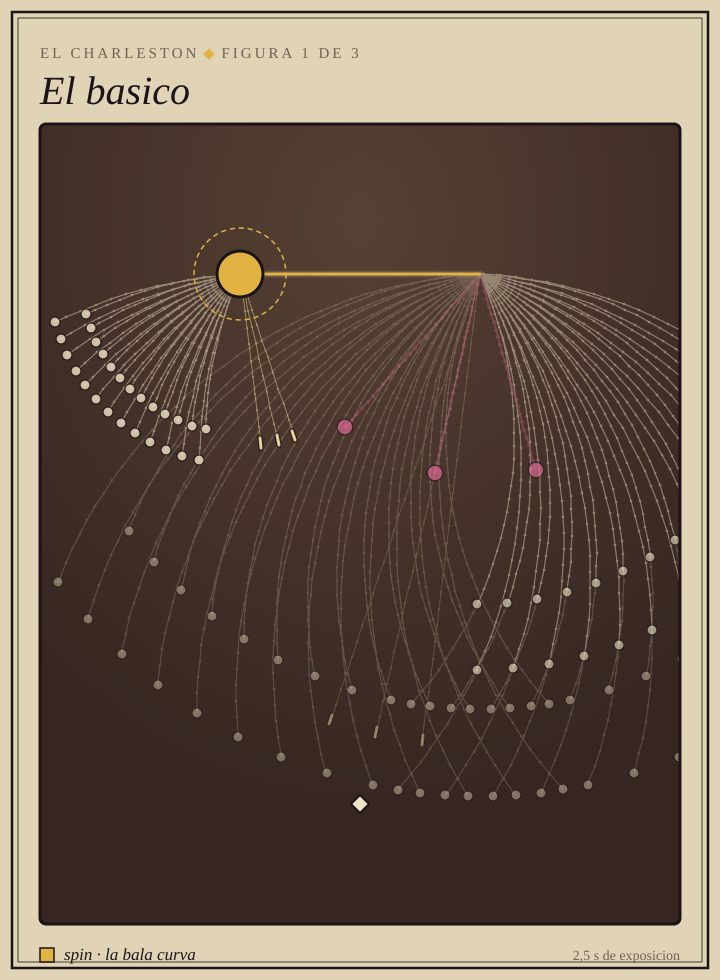 | **1. El basico.** En la pista: el paso de 1923, girando sobre la planta y pateando adelante y atras.<br><br>En el juego: una patada en cada golpe de la clave, un abanico que sale por un lado y barre hacia el otro. Dos capas por patada, una mas rapida que la otra, y el pasillo entre las dos es por donde se cruza. |
| 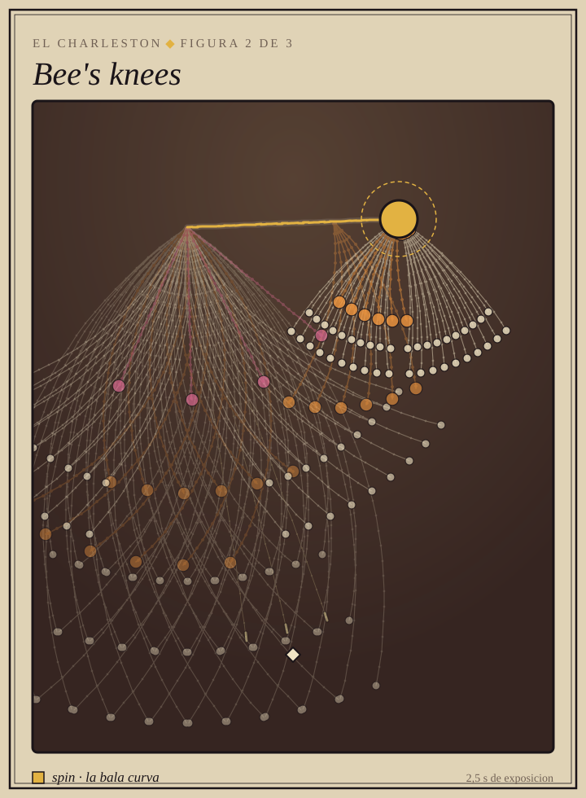 | **2. Bee's knees.** En la pista: las manos en las rodillas; las rodillas se juntan, las manos se cambian a la rodilla contraria y, al abrirse, parece que las rodillas se han atravesado.<br><br>En el juego: un abanico por rodilla. Abiertas, ( ), y el hueco del medio es el sitio seguro. Juntas, los arcos se cruzan en X a la altura de la jugadora. Las manos son las balas medianas, los guantes blancos. |
| 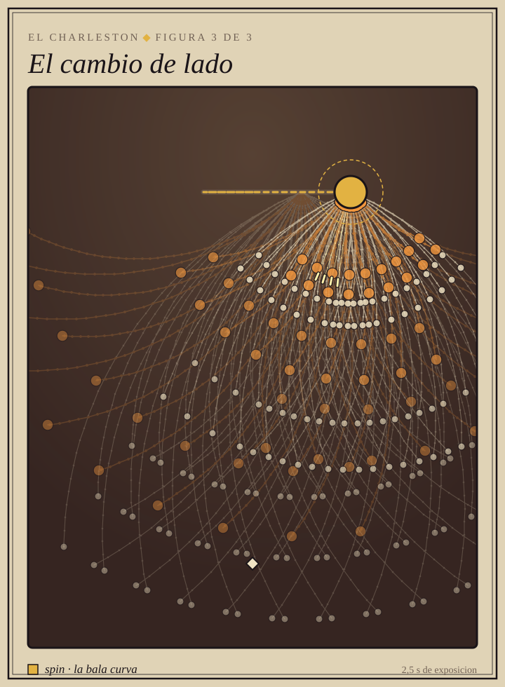 | **3. El cambio de lado.** En la pista: el cierre de la frase, cruzando al otro lado a saltitos.<br><br>En el juego: un compas baila en su sitio y el siguiente cruza el escenario en cuatro saltos, soltando cada tanda donde cae. Tres familias que nunca suenan a la vez: las patadas en la clave, la media vuelta en la corchea de swing y las agujas en el tiempo que la clave se salta. |

---

## El Cancan

**Paris, los bailes populares de los anos 1830.** Sale de la ultima figura de
la cuadrilla, se volvio el escandalo de los music-halls y el cartel del Moulin
Rouge. Sus figuras tienen nombre, y varios son de instruccion militar.

**El verbo: `ttl` corto.** Todas sus balas viven dos segundos o menos, tambien
las rosas. Cada patada es un abanico que sale, corta un trozo de sala y se
desvanece: la pantalla se vacia sola en un compas, y lo que hay que leer no es
la pared que tienes encima sino donde cae la siguiente patada.

```ron
ttl: 1.8,   // la patada dura lo que dura la patada
```

**El objeto: una fila de coristas** cogidas de la mano. Es el unico jefe que
sigue siendo gente, porque una fila de piernas levantandose a la vez es
justamente lo que dispara: sus abanicos salen en fila. Coquetas en la primera
figura, desencajadas en la ultima.

**La musica:** *El galop infernal* de Offenbach (1858), lo que todo el mundo
llama "el cancan". Es el unico baile en dos tiempos: 24 ticks por tiempo, y
todas las esperas son multiplos de 12.

| | |
|---|---|
| 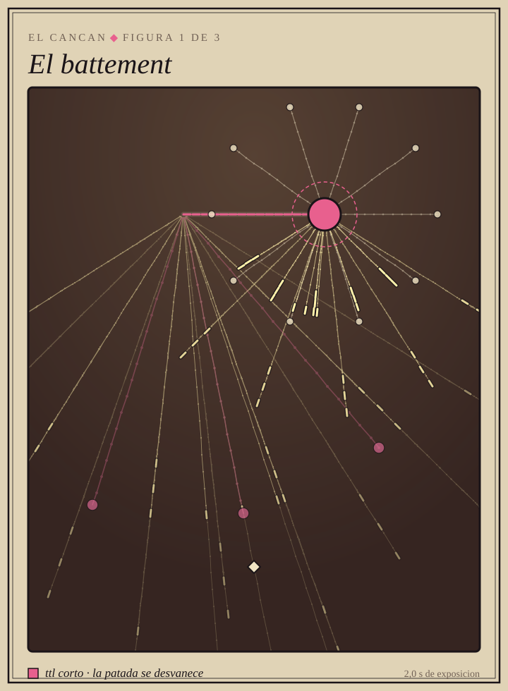 | **1. El battement.** En la pista: la patada alta, la primera que se aprende, y a una con toda la fila.<br><br>En el juego: cinco coristas, cinco piernas, cinco radios de agujas abiertos hacia abajo. Un tiempo con la izquierda y otro con la derecha, y cada pierna cae en el hueco de la anterior: el hueco de este tiempo es la patada del siguiente. |
| 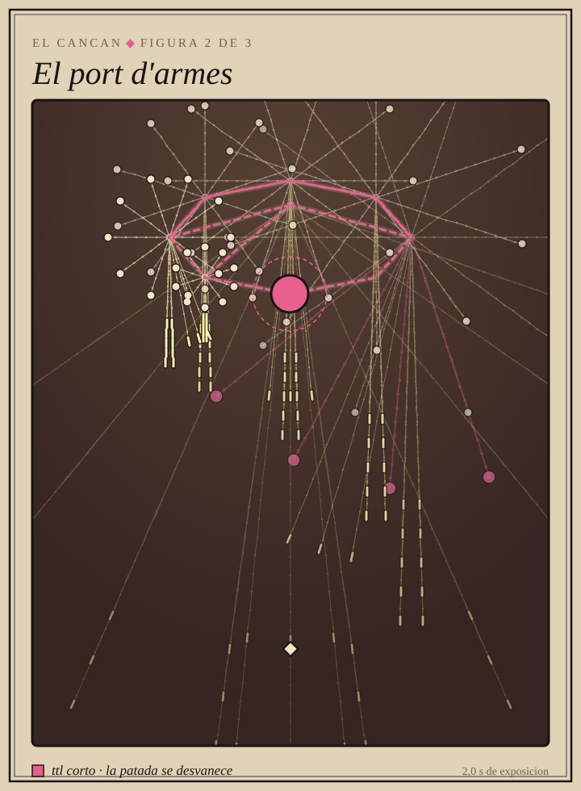 | **2. El port d'armes.** En la pista: la pierna cogida por el tobillo, casi vertical, girando a la pata coja sobre la otra.<br><br>En el juego: el jefe da la vuelta en ocho saltos alrededor de una elipse. En cada salto la pierna en alto cae recta como una columna de agujas y el pie de apoyo suelta un corro que se apaga enseguida. Las columnas barren la sala al ritmo del giro. |
| 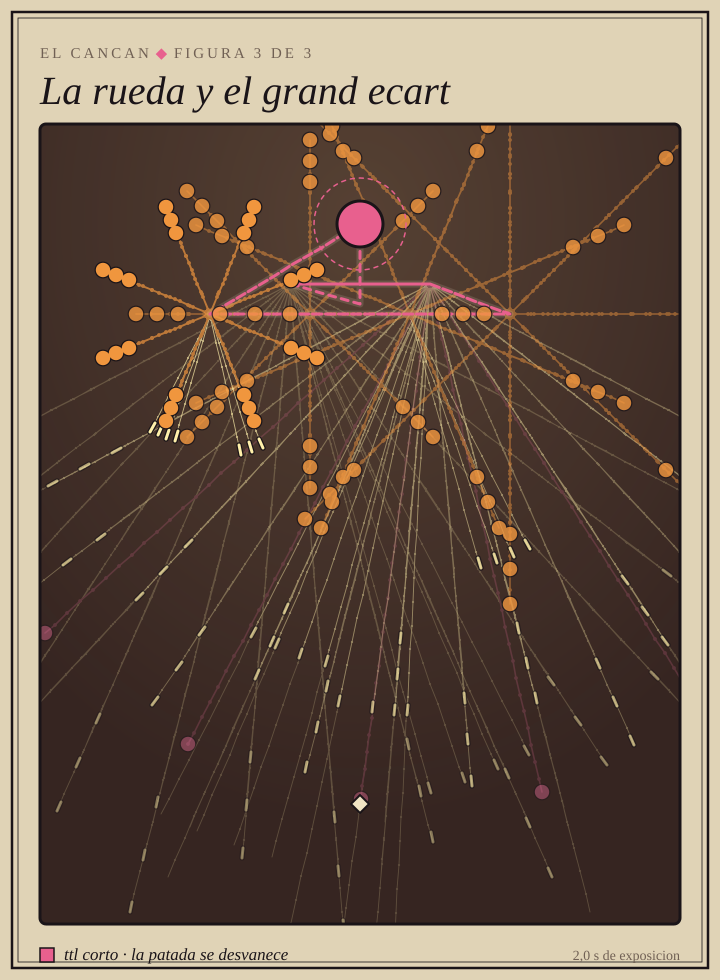 | **3. La rueda y el grand ecart.** En la pista: la voltereta lateral y el salto que cae al suelo abierto de piernas, el final de siempre.<br><br>En el juego: dos compases de patadas a la corchea; luego la rueda cruza la sala en cuatro saltos, un anillo de ocho radios girado medio radio cada vez, que es lo que la hace rodar. Y el espagat: dos abanicos a las esquinas, y el sitio libre es justo entre sus piernas. |
